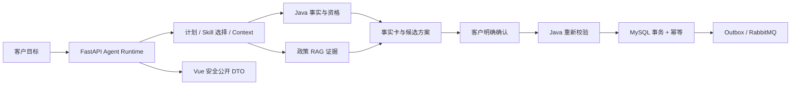
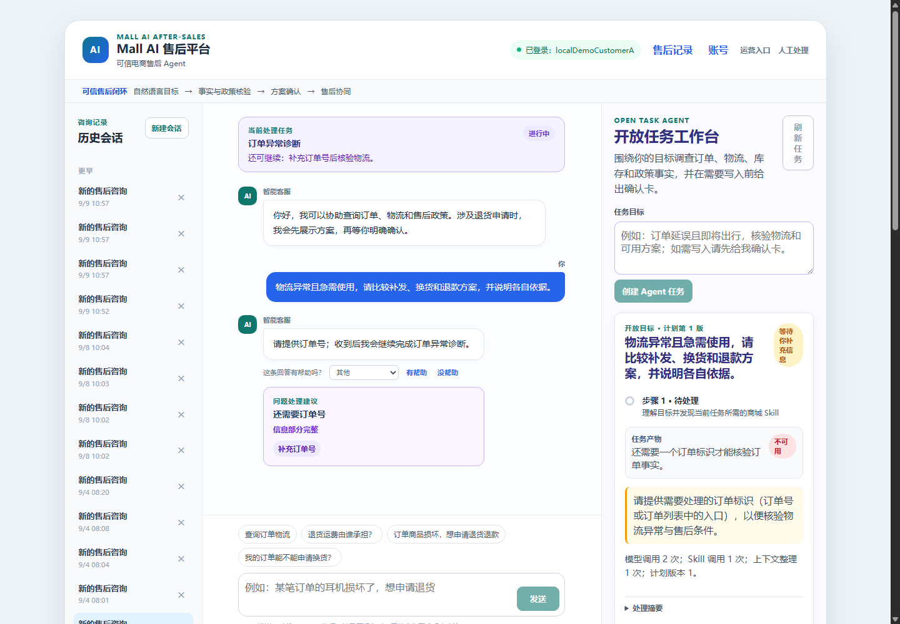
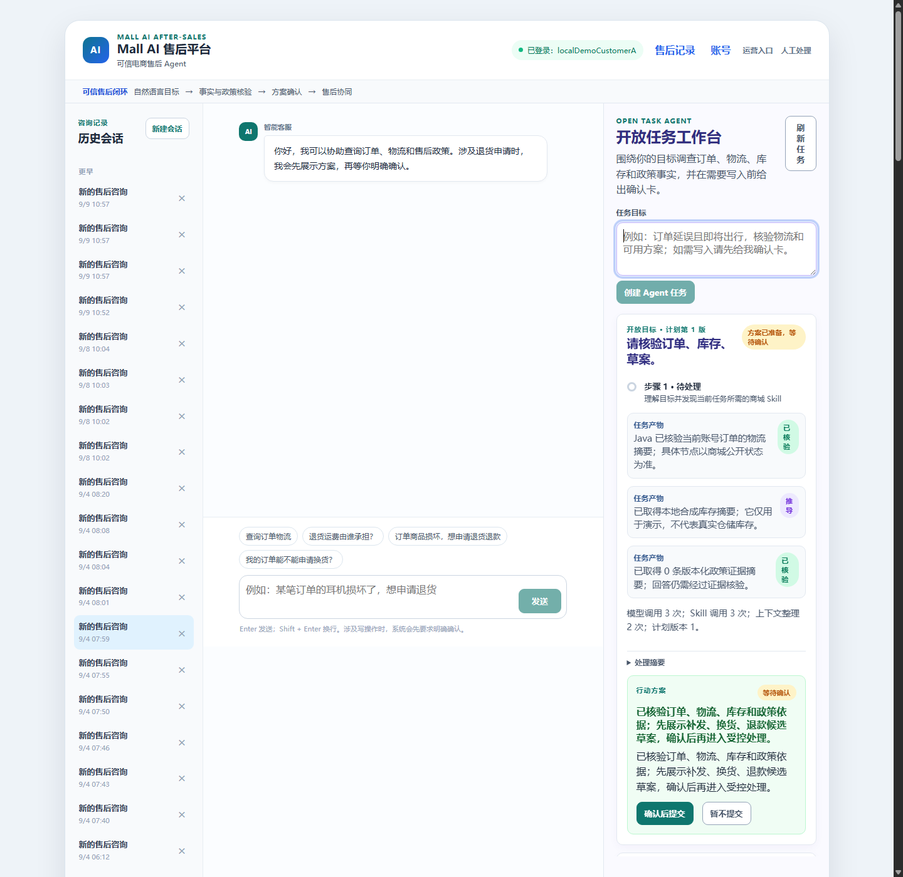
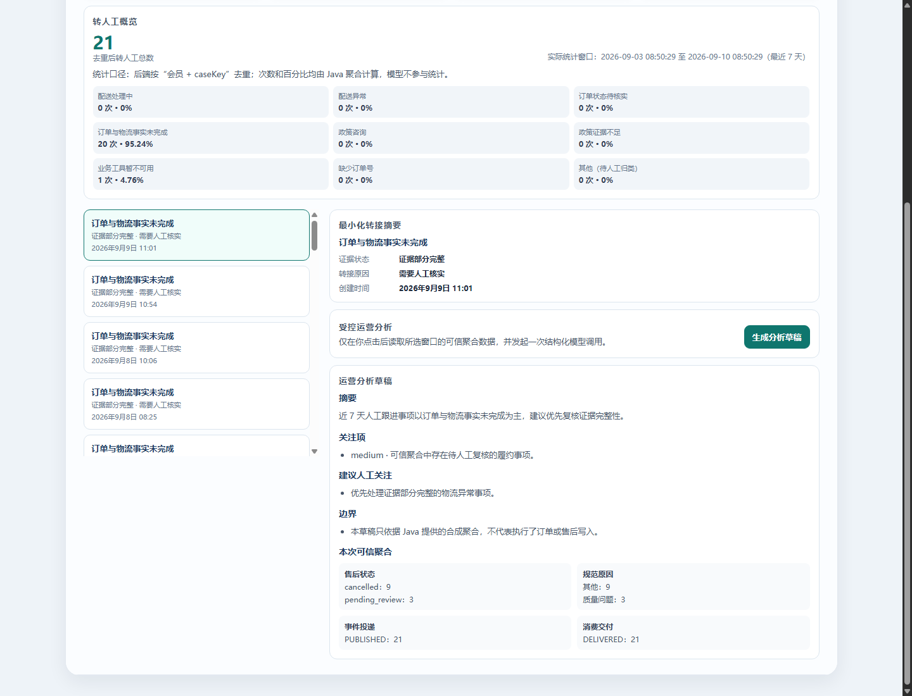
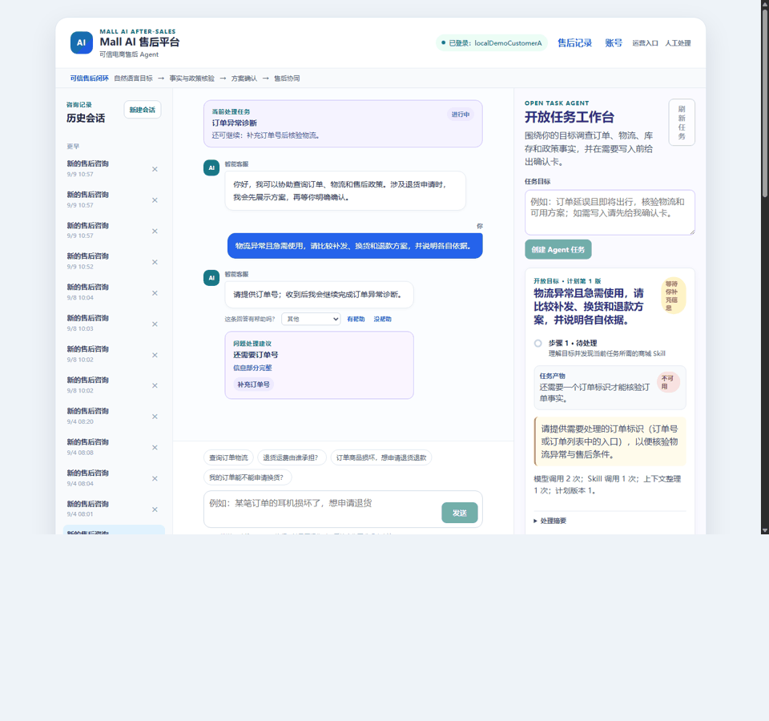

# Mall AI 售后平台｜可信电商开放任务 Agent

[](https://github.com/Eleven617/mall-ai-after-sales-platform/actions/workflows/ci.yml)
[](https://github.com/Eleven617/mall-ai-after-sales-platform/actions/workflows/quality-evaluation.yml)

一个面向电商售后的可信开放任务 Agent：用户可以用自然语言提出“查清事实并给出处理方案”的目标，系统调查订单、物流、库存和政策事实，形成可审阅的 ActionProposal，并在明确确认后交给 Java 业务层做最终校验与写入。

本项目是基于 Apache-2.0 的 [`macrozheng/mall`](UPSTREAM.md) 二次开发的本地可运行作品集，不是生产 SaaS。仓库中的数据、账号、评测和截图均为合成或脱敏数据。

## 30 秒了解项目

### 一个核心 Agent，两个辅助 AI 能力

| 能力 | 面向角色 | 输入与输出 | 写入边界 |
| --- | --- | --- | --- |
| **统一售后开放任务 Agent（核心）** | 客户 | 自然语言目标 → 事实卡、政策证据、候选方案、确认卡 | LLM 不能写库；客户确认后由 Java 重新校验并写入 |
| **运营分析 AI（辅助）** | 运营人员 | Java 可信聚合 → 受限分析草稿 | 只读，无业务写入 |
| **AI 质量评测（辅助）** | 开发/质量人员 | 版本化合成 EvalCase → 硬规则结果与失败摘要 | 不读取生产聊天，不自动改代码或规则 |

MCP 只读工具、人工售后工作台和 LangGraph 确定性节点是能力边界或执行设施，不是额外的在线 Agent。

### 为什么它不是普通聊天机器人

LLM 只负责受限 Schema 内的目标理解、任务计划、只读调查建议和草案表达。`mall2/` 的 Java 服务是订单事实、JWT/归属、资格、状态机、幂等、事务、Outbox 和最终写入的唯一权威；FastAPI 不直连商城业务库；浏览器只展示公开 DTO。任何创建、取消、修改或异步动作都必须经过服务端生成的 Proposal、用户确认和 Java 再校验。

### 核心闭环



## 能力与真实边界

- **开放任务售后 Agent**：政策、资格、订单/物流调查、申请草案、列表、状态、取消、修改、跟进和自然语言任务切换；只读调查可以在已注册 Skill 范围内多步执行。
- **事实与知识分离**：订单、物流、资格和售后状态来自 Java；政策问题使用版本化 RAG。Dense 是当前默认检索，Hybrid/Rerank 只保留为可复现实验。
- **受控副作用**：`draft`、`commit`、`async_task` 都由 Runtime 生成带 owner、TTL、版本和内容哈希的 ActionProposal；没有确认或 Java 校验失败时安全停止。
- **上下文与恢复**：Context Curator 只处理允许的 Artifact 摘要；任务记忆有 owner/TTL 范围；暂停、恢复、重规划不会保存完整原话、Token、原始工具载荷或思维链。
- **可评测、可追踪**：Trace 是 allow-list 元数据；质量 Agent 使用合成 Case 和确定性比较器，观测故障不改变客户业务结果。

## 真实运行截图

以下图片由本地 Docker Compose、真实 Chrome/CDP 页面和合成账号/订单生成。


客户页展示一个自然语言售后目标和安全的任务状态。


Agent 工作台展示 Java 事实、政策证据、候选草案和“等待确认”交易关口；截图中没有直接写入业务。


运营侧只读查看可信聚合和受限分析草稿。


质量开发者查看 `contract_mock` 合同结果和失败边界。


GIF 是上述真实页面的轻量流程剪辑，不代表线上服务或真实客户数据。

社交预览图：[`docs/assets/social-preview.png`](docs/assets/social-preview.png)。该图片已上传到 GitHub 仓库 Social preview，并通过公开页面核对远程图片尺寸与本地文件一致；本项目没有创建 Release 或改变仓库可见性。

## 一个真实开放任务案例

合成客户提出：**“物流异常且急需使用，请比较补发、换货和退款方案，并说明各自依据。”** 页面和本次展示 Provider 的实际流程是：

1. Agent 识别“物流异常、时间紧迫、需要比较方案”的开放目标，并发现订单标识仍需补充；
2. 在允许的只读范围内调查订单/物流、库存和售后政策证据；
3. 将事实与证据整理成 Artifact，必要时向客户澄清缺失信息；
4. 形成补发、换货、退款候选草案，并显示等待确认的交易关口；
5. 只有客户明确确认后，Java 才会重新校验身份、归属、资格、状态、版本和幂等键，再执行事务写入；
6. 外部履约未接入时，页面只能显示待处理/人工处理，不会伪造退款、补发或维修成功。

`customer-open-task.png` 展示目标和澄清，`agent-investigation-workspace.png` 展示事实、政策和候选草案；本次截图停在确认之前，没有业务写入。确认后的 Java 复核与 Outbox 路径由定向测试和现场报告单独证明，不能把展示截图当作完整交易成功。

## 当前验证摘要

各项结果独立统计，不能相加；所有本机/合成结果都不等于生产 SLA 或真实用户泛化。

| 范围 | 真实结果 | 口径 |
| --- | --- | --- |
| FastAPI 回归 | `353 passed`、`7` 个参数化子断言 | 当前本地 Python 环境；命令见下方 |
| Java 定向测试 | portal `14/14`，admin `6/6` | Spring/Maven 合同与人工协同/运营边界 |
| Vue | `npm run build` 通过 | TypeScript 检查与 Vite production build |
| RAG 2.0 | Dense/Hybrid/Hybrid+Rerank 各 `52/52` | 52 条版本化合成黄金集；Dense 默认，Dense MRR `0.948718`、nDCG@3 `0.962147` |
| Agent/质量合同 | quality `17/17`；任务编排 `11/11`；Chunk/Metadata `8/8` | 无真实模型 Key、无业务写入 |
| v3 deterministic | `478/478`，代表性 Runtime `8/8` | Release Manifest 合同，不是 478 条现场 E2E |
| 本地字段验收 | browser `24/24`、Java/MySQL `30/30`、fault `36/36`、durable `32/32` | 最新报告来自合成 Docker/Chrome 现场；详见 [测试证据](docs/TEST_AND_DEMO_EVIDENCE.md)，不宣称生产能力 |
| GitHub Actions | 以当前提交对应的最新运行链接为准 | 不能用历史绿色运行外推新提交；见 [展示升级证据](docs/evidence/github-showcase-refresh.md) |

`live_model_synthetic` 的历史报告、完整自然语言泛化和真实外部履约系统必须单独理解；旧报告如果提交号与当前 HEAD 不一致，会被标记为 stale，不与当前结果合并。

## 评测发现与改进方向

历史 live-model 与 Grounding 报告保留在 `docs/evidence/`/`docs/TEST_AND_DEMO_EVIDENCE.md` 中。它们曾出现 Skill/事实缺失、Proposal/恢复缺失和未批准证据来源等 Bad Case；由于报告提交号不等于当前 HEAD，已标为 stale，不能改写成当前模型准确率。当前的做法是：用确定性比较器守住硬合同，用无敏感 EvalCase 复现失败，再由人工确认是否需要通用 Prompt、Schema 或工具边界调整；不靠新增关键词或隐藏失败来“修复”数字。

## 从干净克隆启动

前置条件：Docker Desktop 已启动。完整模型演示需要运行者自己的 DeepSeek Key；不配置 Key 仍可验证结构、权限和确定性合同。

```powershell
git clone https://github.com/Eleven617/mall-ai-after-sales-platform.git
Set-Location .\mall-ai-after-sales-platform
.\scripts\Prepare-PublicDemo.ps1
```

脚本会在本机创建被 Git 忽略的 `.env`、提示输入自己的 Key、准备本地 Embedding/Chroma 并启动 Compose；不会打印或提交 Key、Token、密码、模型权重或索引。只跑无模型合同时：

```powershell
.\scripts\Prepare-PublicDemo.ps1 -SkipLiveModel
```

启动后：

- Web 工作台：<http://127.0.0.1:5173>
- FastAPI 文档：<http://127.0.0.1:8000/docs>
- Java portal：<http://127.0.0.1:8085>

本地演示账号由运行者自行初始化，不提供公共密码：

```powershell
.\scripts\Initialize-LocalDemoAccess.ps1 -PrepareCustomerFixtures
```

脚本只在本机 Compose 数据库设置 `localDemoCustomerA`、`localDemoCustomerB`、`localDemoOperations`、`aiQualityDeveloper`、`afterSalesProcessor` 等最小权限身份；密码不会写入仓库。

## 可复核命令

```powershell
# FastAPI 全量回归
Push-Location .\mall-ai-service
.\.venv\Scripts\python.exe -m pytest -q
.\.venv\Scripts\python.exe scripts\validate_v3_release_manifest.py --json
.\.venv\Scripts\python.exe scripts\run_v3_release_preflight.py --json
Pop-Location

# Vue 构建
Push-Location .\mall-ai-web
npm run build
Pop-Location

# Java 定向测试（根 POM 默认跳过测试，显式关闭跳过）
Push-Location .\mall2
mvn -pl mall-portal -am "-Dtest=AiCaseHandoffServiceImplTest,AiServiceCaseServiceImplTest,AiServiceCaseOutboxPublisherTest,AiServiceCaseEventReceiverTest,SpringDataWebExposureContractTest,MongoMicrometerCompatibilityTest" "-DskipTests=false" "-Dsurefire.failIfNoSpecifiedTests=false" test
mvn -pl mall-admin -am "-Dtest=AiServiceOperationsServiceImplTest,AiServiceOperationsControllerTest" "-DskipTests=false" "-Dsurefire.failIfNoSpecifiedTests=false" test
Pop-Location
```

更完整的现场命令、报告路径、Fixture hash、截图 hash 和远程门禁见 [GitHub 展示升级证据](docs/evidence/github-showcase-refresh.md)、[测试与演示证据](docs/TEST_AND_DEMO_EVIDENCE.md) 和 [v3 发布证据](docs/evidence/v3.0-release-evidence.md)。

## 仓库结构与贡献边界

| 目录 | 责任 |
| --- | --- |
| `mall2/` | 基于上游 mall 的 Spring Boot 商城、JWT、领域事实、事务、Outbox/RabbitMQ 与人工协同 |
| `mall-ai-service/` | FastAPI Agent Runtime、LangGraph 确定性边界、RAG、Skill/Tool、Context、Trace/Eval、MCP |
| `mall-ai-web/` | 客户、运营、质量和人工处理人员的 Vue 页面与安全公开 DTO |
| `docs/` | 架构、评测、Release Gate、展示和贡献证据 |
| `docker-compose.yml` | 本地合成演示环境 |

本项目新增的重点是 AI 售后入口、受控 Task Runtime、统一售后编排、RAG/证据核验、Skill Catalog、Trace/Eval、MCP 只读边界、Java 事实投影、人工案件、幂等 Outbox/RabbitMQ、角色化 Vue 页面和证据化交付。订单、会员和商城基础能力仍应按 [UPSTREAM.md](UPSTREAM.md) 归属于 `macrozheng/mall` 上游；完整分工见 [贡献矩阵](docs/CONTRIBUTION_MATRIX.md) 和 [NOTICE](NOTICE)。

`v3.0` 在仓库中表示 Agent Runtime 合同与发布门禁版本，不表示已经创建公开 `v3.0.0` Release。项目未接入真实支付、仓储、物流或维修系统，不宣称生产准确率、用户量、QPS、成本下降或 SLA。

## 进一步阅读

- [架构与责任边界](docs/architecture.md)
- [GitHub 展示升级证据](docs/evidence/github-showcase-refresh.md)
- [测试与演示证据](docs/TEST_AND_DEMO_EVIDENCE.md)
- [公开发布记录](docs/PUBLIC_RELEASE_RECORD.md)
- [评测、Profile 与安全回放](docs/evaluation.md)
- [上游/二次开发/AI 辅助贡献矩阵](docs/CONTRIBUTION_MATRIX.md)
- [隐私、数据可见性与非目标](docs/privacy-and-boundaries.md)
- [贡献与本地验证](CONTRIBUTING.md)
- [安全问题](SECURITY.md)
- [工程协作规则](AGENTS.md)
