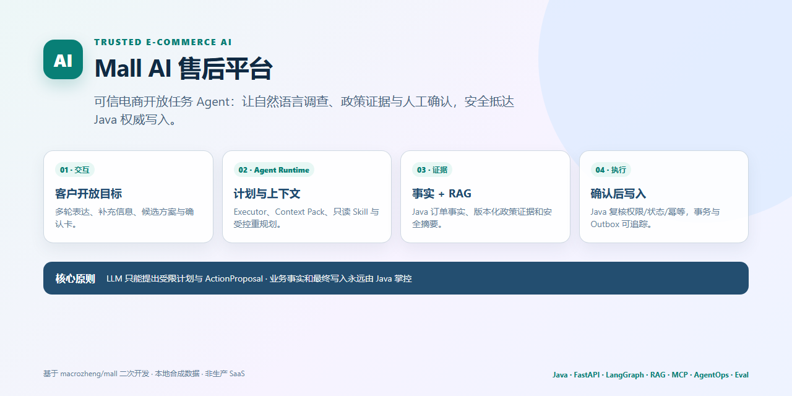
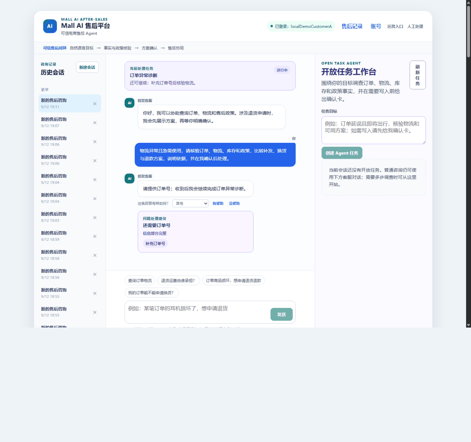
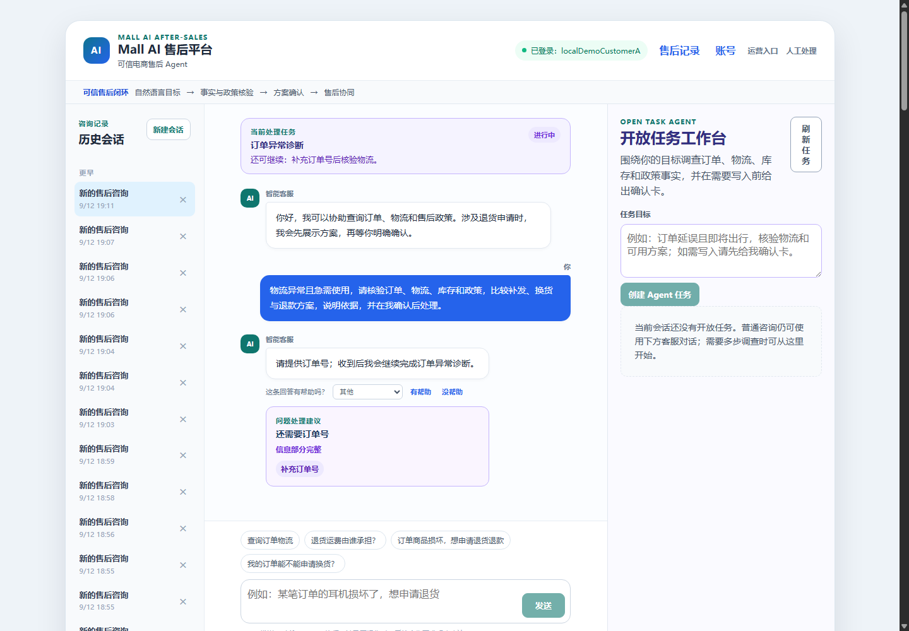
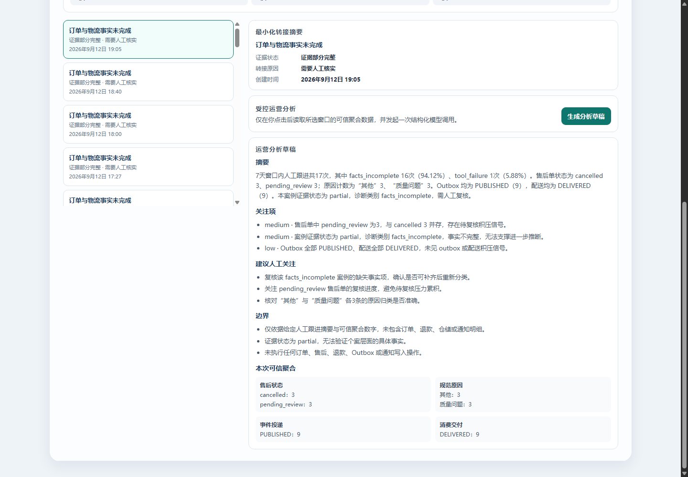
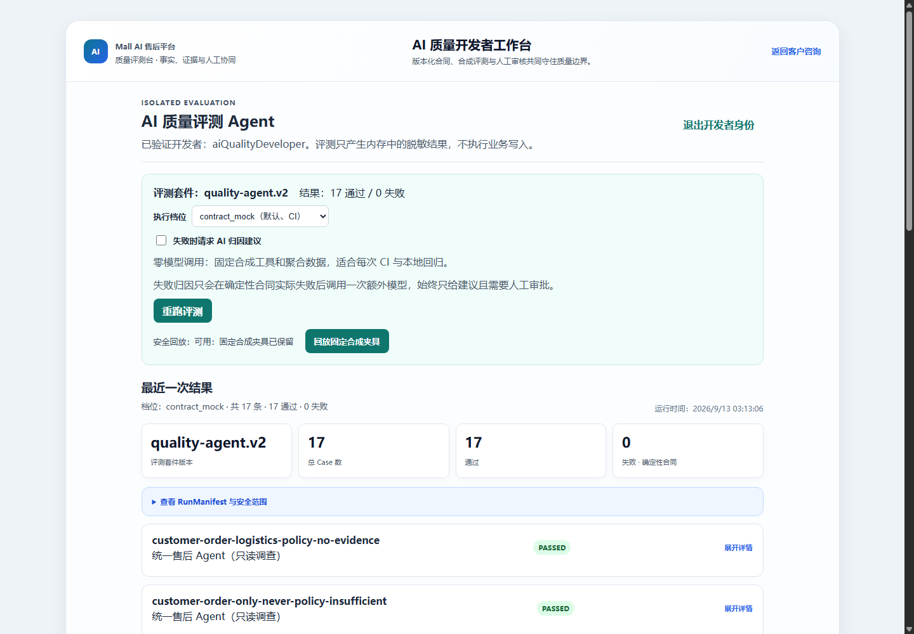
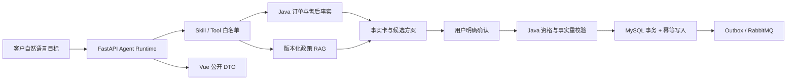

# Mall AI 售后平台

[](https://github.com/Eleven617/mall-ai-after-sales-platform/actions/workflows/ci.yml)
[](https://github.com/Eleven617/mall-ai-after-sales-platform/actions/workflows/quality-evaluation.yml)
[](LICENSE)



面向电商售后的可信 Agent Runtime：用户用自然语言描述问题，系统调查订单与政策事实，生成可解释的处理方案，并在用户确认后由 Java 业务层完成最终校验与写入。

这是基于 Apache-2.0 [`macrozheng/mall`](UPSTREAM.md) 二次开发的全栈 AI 工程作品集，重点展示 Agent 编排、RAG 证据、受控工具调用和真实业务写入边界如何协同工作。

## 产品能力

| 能力 | 用户体验 | 工程实现 |
| --- | --- | --- |
| 售后开放任务 | 用一句话描述退货、补发、维修或人工协助需求 | FastAPI Task Runtime + 受限 Skill Catalog + 结构化 Proposal |
| 可信确认写入 | 先看到事实、证据和方案，再明确确认 | Java 权威事实、资格重校验、状态机、幂等键和事务写入 |
| 政策问答 | 回答带有可追溯来源，证据不足时主动拒答 | 版本化政策 RAG + Evidence Verifier + 来源白名单 |
| 暂停与恢复 | 缺少信息时保留同一任务，补充信息后继续 | durable task state、TTL、owner 校验和恢复合同 |
| 事实变化重规划 | 订单状态变化后让旧方案失效并重新核验 | 内容 Hash、事实版本、Proposal 过期保护 |
| 运营与质量工作台 | 查看售后趋势、任务状态和评测结果 | Vue 角色化工作台 + 只读聚合 API + 可复现 EvalCase |

## 先看演示

### 售后任务闭环

自然语言目标 → 调查订单与政策 → 生成方案 → 用户确认 → Java 重校验 → 一次性写入 → 状态回查。



### 可恢复的 Agent 工作流




### 面向团队的工作台




完整素材、截图来源和场景对账见[展示证据](docs/evidence/final-showcase-evidence.md)。仓库也提供无模型 deterministic/replay 入口，用于稳定复现状态机、权限和写入合同。

## 核心设计



模型只负责受限 Schema 内的理解、调查编排和方案草拟；不能自创 Skill、直接访问业务库或提交业务写入。最终权限、资格、状态和写入始终由 Java 服务端决定，浏览器只消费公开 DTO。

## 技术栈

- **AI Runtime**：Python、FastAPI、Pydantic、JSON Schema、Executor / Curator / Critic、结构化输出网关。
- **知识与证据**：版本化政策库、Dense / Hybrid / Rerank 检索、证据核验和 grounding 评测。
- **业务后端**：Java Spring Boot、MySQL、Redis、RabbitMQ、Outbox、JWT、事务与幂等。
- **前端工作台**：Vue、Vite，覆盖客户售后、运营分析、质量评测和人工协同视图。
- **工程质量**：pytest、JUnit、Docker Compose、确定性 replay、故障注入、GitHub Actions。

## 代码导航

- `mall-ai-service/app/runtime/`：任务状态机、计划、Skill 白名单、Proposal、确认和安全停止。
- `mall-ai-service/app/services/`：售后编排、RAG、MCP、Trace、评测和角色化 API。
- `mall2/mall-portal/`、`mall2/mall-admin/`：订单事实、权限、资格、幂等、事务和人工协同。
- `mall-ai-web/src/`：客户、运营、质量和人工处理人员的 Vue 页面。
- `evals/`、`mall-ai-service/scripts/`：版本化 EvalCase、现场 Runner 和公开发布门禁。

## 本地运行

需要 Docker Desktop；完整模型演示使用运行者自己的 Provider Key。没有 Key 也可以运行 deterministic 合同、权限和现场验证。

```powershell
git clone https://github.com/Eleven617/mall-ai-after-sales-platform.git
Set-Location .\mall-ai-after-sales-platform
.\scripts\Prepare-PublicDemo.ps1
```

只运行无模型合同：

```powershell
.\scripts\Prepare-PublicDemo.ps1 -SkipLiveModel
```

启动后访问 <http://127.0.0.1:5173>、<http://127.0.0.1:8000/docs> 和 <http://127.0.0.1:8085>。本地账号使用初始化脚本创建，凭据不会写入仓库。

## 验证摘要

当前公开候选的工程验证包括：FastAPI JUnit `511 passed`、v3 deterministic 合同 `478/478`、Representative `8/8`、Contract Replay `36/36`、Java portal 核心 `12/12`、admin `6/6`、Spring context `1/1`、现场合成 Runner `122/122`。当前 DeepSeek 针对性在线评测为 `5/5`，其中 Grounding `4/4`。

这些数字分别对应不同的工程合同、现场 Runner 和评测套件，不相加为单一准确率。历史完整模型评测与修复演进保留在[评测演进记录](docs/evidence/evaluation-evolution.md)；其中补充集不是独立盲测集。所有评测数据和展示账号均为合成或脱敏数据。

## 进一步阅读

- [架构与责任边界](docs/architecture.md)
- [展示素材证据](docs/evidence/final-showcase-evidence.md)
- [测试与演示证据](docs/TEST_AND_DEMO_EVIDENCE.md)
- [公开发布记录](docs/PUBLIC_RELEASE_RECORD.md)
- [评测演进与历史结果](docs/evidence/evaluation-evolution.md)
- [贡献与本地验证](CONTRIBUTING.md)
- [安全问题](SECURITY.md)
- [上游归属](UPSTREAM.md)

## 许可

本项目按 Apache-2.0 发布；上游商城代码及其许可说明见 [NOTICE](NOTICE) 与 [UPSTREAM.md](UPSTREAM.md)。
