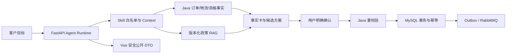

# Mall AI 售后平台

[](https://github.com/Eleven617/mall-ai-after-sales-platform/actions/workflows/ci.yml)
[](https://github.com/Eleven617/mall-ai-after-sales-platform/actions/workflows/quality-evaluation.yml)

一个面向电商售后的可信 Agent Runtime：用户用自然语言提出目标，系统调查订单、物流、库存和政策事实，比较候选处理方案，在明确确认后由 Java 业务层完成最终校验和写入。

本项目基于 Apache-2.0 的 [`macrozheng/mall`](UPSTREAM.md) 二次开发，公开数据、账号、评测和截图均为合成或脱敏数据。它是可本地运行的工程作品集，不是生产 SaaS。

## 30 秒了解项目

当前 Runtime 的离线回归为 FastAPI JUnit **508/508**（492 cases + 16 subtests）。

> 当前展示状态：`NOT_COMPLETE`。Runtime `d4ec989548e953a8f8c5ee7ceef4ea13b464fbfb` 的 Grounding v3 最终针对性在线评测为 **5/5**。三批累计 98 HTTP attempts、291,444 tokens，Ledger 全部对账。最后一批首条真实售后链的 Proposal、Java 重校验、确认写入与回查均通过；其页面已在零模型、零任务写入条件下事后补采。暂停恢复与事实变化两条当前 live 链仍未执行，三批额度已耗尽，因此未合并 `main`。

### 为什么不是普通聊天机器人

LLM 只在受限 Schema 内理解目标、选择已注册 Skill、规划只读调查并生成草案。订单、物流、资格和售后状态由 Java 提供；JWT/归属、资格、状态机、幂等、事务、Outbox 与最终写入也由 Java `mall2/` 负责。没有用户确认和 Java 重校验，模型不能写业务库，浏览器也不能绕过服务端写接口。

核心数据流：



### 三个产品 Agent

| 能力 | 面向角色 | 主要输入/输出 | 写入边界 |
| --- | --- | --- | --- |
| 统一售后开放任务 Agent | 客户 | 自然语言目标 → 事实卡、政策证据、候选方案、确认卡 | Java 确认后重校验并写入 |
| 运营分析 AI | 运营人员 | Java 可信聚合 → 受限分析草稿 | 只读 |
| AI 质量评测 | 开发/质量人员 | 版本化合成 EvalCase → 硬规则结果与失败摘要 | 不读取生产数据，不自动改代码 |

MCP 只读工具、人工售后工作台和 LangGraph 确定性节点是能力边界或执行设施，不是额外的在线 Agent。

## 三条展示链路（当前复核状态）

产品设计和 deterministic/replay 入口覆盖三条链路：

1. 开放目标 → 多步事实/政策调查 → 候选 → 用户确认 → Java 重校验/写入 → 状态回查；
2. 等待输入 → 暂停保留 → 政策岔开 → 同一任务恢复；
3. 事实版本变化 → 旧结果失效 → 重新核验 → 新方案或人工交接。

无模型 deterministic/replay 运行只证明受控 Runtime 合同、Proposal/确认边界和 Java 权威写入路径；它不证明真实模型的自然语言泛化。历史正式在线评测曾完成三条展示链，主集 `69/72`、补充集 `30/36`、Grounding `49/52`；这些结果及失败分类保持不可变。当前 Runtime 的最终针对性复测为 `5/5`，不能与历史完整评测拼接。该批首条真实售后链业务断言通过后发生浏览器采集故障，已对持久化主链做只读事后补采；另外两条当前 live 链未执行。录制入口仍支持无模型 dry-run：[`scripts/Capture-PublicShowcase.ps1 -DryRun`](scripts/Capture-PublicShowcase.ps1)。

第三批主链事后补采（不是原批次实时录屏）：


当前 Runtime 的暂停恢复与事实变化素材为 **deterministic**，不是 live 模型证据：

- [暂停与同任务恢复](docs/assets/showcase-deterministic-d4ec989/clarify-pause-resume.gif)
- [Java 事实变化后重新规划](docs/assets/showcase-deterministic-d4ec989/fact-change-replan-handoff.gif)

采集时间、素材 Hash、工具版本与限制见 [展示采集修复证据](docs/evidence/v3.0.4-showcase-capture-repair.md)。

## 架构与代码入口

- `mall-ai-service/app/runtime/`：Task Runtime、计划、Skill/Tool 白名单、Context 投影、Proposal 和安全停止。
- `mall-ai-service/app/services/`：统一售后、RAG、MCP、任务记忆、Trace/Eval 与角色化 API。
- `mall2/mall-portal/`、`mall2/mall-admin/`：Java 事实、权限、资格、状态、幂等、事务、Outbox 和人工协同。
- `mall-ai-web/src/`：客户、运营、质量和人工处理人员的 Vue 页面，只消费公开 DTO。
- `evals/` 与 `mall-ai-service/scripts/`：版本化 EvalCase、RAG/grounding、v3 manifest、现场和发布门禁。

政策 RAG 是证据层，订单事实仍走 Java。Dense 是当前默认检索；Hybrid 和 Hybrid+Rerank 保留为可复现实验。

## 当前评测结论

结果按套件独立统计，不相加，也不外推为生产 SLA 或真实用户泛化：

- 当前候选收口的 FastAPI JUnit 为 `508 passed`（492 pytest cases + 16 subtests），exit `0`；
- v3 deterministic 发布合同为 `478/478`，代表性 Runtime 为 `8/8`；本轮 contract replay 为 `36/36`，Provider `0`；这些都不是浏览器 E2E 或真实模型效果；
- Java portal 核心 `12/12`、admin `6/6`、Spring context `1/1`、Vue production build、8 服务 Compose 和四类现场 Runner 均已在当前候选环境验证通过；
- 当前现场 `122/122` 绑定 Runtime/image `d4ec989548e953a8f8c5ee7ceef4ea13b464fbfb`，execution HEAD `25d9150cfa5b163a40471b3940a67204be17d8c7` 仅包含现场 Runner/测试差异并通过无 Runtime 漂移校验；它来自本地 Docker、Chrome、Java/MySQL、隔离故障 Compose 与合成 Fixture，不代表真实模型效果或生产 SLA；
- RAG Dense、Hybrid、Hybrid+Rerank 的 52 条版本化合成政策 Case 指标只说明检索排序质量，不是答案准确率；
- 历史 supplemental evaluation set 不是独立盲测集，旧结果只作为开发期审计，不能外推到真实用户；
- 真实模型主集、补充集、Grounding 已在历史批次执行并单独披露；两轮针对性复测分别绑定 `62b61c2` 与 `1bfe280`，均为 `10/11`。当前 Runtime `d4ec989` 的最后一批仅包含 4 个 Grounding 项与 1 个普通成功对照，结果为 `5/5`；这证明本次 Grounding v3 针对性范围通过，不代表完整 `72/36/52` 重新通过。

历史失败、根因和修复过程见 [evaluation-evolution](docs/evidence/evaluation-evolution.md) 与 [failure matrix](docs/evidence/final-agent-failure-matrix.md)。当前数字的唯一事实源是 [`current-release-facts.json`](docs/evidence/current-release-facts.json)，并由 [`validate_public_release.py`](scripts/validate_public_release.py) 在 CI 中校验。

## 本地运行

前置条件：Docker Desktop 已启动。完整模型演示需要运行者自己的 DeepSeek Key；不配置 Key 也可以运行结构、权限和 deterministic 合同。

```powershell
git clone https://github.com/Eleven617/mall-ai-after-sales-platform.git
Set-Location .\mall-ai-after-sales-platform
.\scripts\Prepare-PublicDemo.ps1
```

只运行无模型合同：

```powershell
.\scripts\Prepare-PublicDemo.ps1 -SkipLiveModel
```

启动后：<http://127.0.0.1:5173>、<http://127.0.0.1:8000/docs>、<http://127.0.0.1:8085>。

```powershell
.\scripts\Initialize-LocalDemoAccess.ps1 -PrepareCustomerFixtures
```

本地账号由运行者自行初始化，密码不会写入仓库。

## 当前验证范围

验证使用本地 Docker/Chrome/Java/MySQL/Redis/RabbitMQ 和合成 Fixture。仓库不接入真实支付、仓储、物流或维修履约，不宣称生产 SLA、用户量、QPS、成本下降或真实用户准确率。价格未配置，因此不能从模型 Token 推导真实费用。

## 上游归属与贡献边界

`mall2/` 的商城订单、会员和后台基础能力来自 `macrozheng/mall` 上游；本项目新增的是 AI 售后入口、受控 Task Runtime、统一售后编排、RAG/证据核验、Skill/Tool、Trace/Eval、MCP 只读边界、Java AI 接口、人工案件和角色化 Vue 工作台。详细边界见 [UPSTREAM.md](UPSTREAM.md)、[贡献矩阵](docs/CONTRIBUTION_MATRIX.md) 与 [NOTICE](NOTICE)。

## 进一步阅读

- [架构与责任边界](docs/architecture.md)
- [展示素材证据](docs/evidence/final-showcase-evidence.md)
- [测试与演示证据](docs/TEST_AND_DEMO_EVIDENCE.md)
- [公开发布记录](docs/PUBLIC_RELEASE_RECORD.md)
- [评测、Profile 与安全回放](docs/evaluation.md)
- [贡献与本地验证](CONTRIBUTING.md)
- [安全问题](SECURITY.md)
- [工程协作规则](AGENTS.md)
