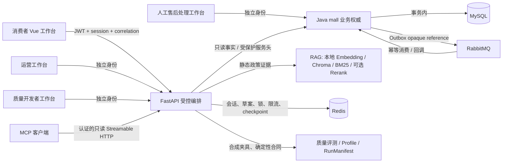

# 最终架构与责任边界

项目定位为本地、合成数据的“可信 AI 售后与 AgentOps 平台（基于 Apache-2.0 开源 mall 的二次开发）”。它不是自动退款系统、生产 SaaS 或 Agent Swarm。

## 不可替代的职责

| 层 | 负责 | 明确不负责 |
| --- | --- | --- |
| Vue | 展示公开 DTO、发起已确认动作、角色页面隔离 | 保存内部 ID/Trace/Token，决定权限或直接业务写入 |
| FastAPI | 受限结构化意图、LangGraph 编排、RAG 证据、公开投影、Redis 待确认状态、离线评测与 MCP | 直连商城业务库、判断最终归属/资格、直接写订单/售后/退款 |
| Java | JWT、订单/物流/资格事实、售后状态机、幂等、事务、Outbox、人工案件动作 | 把模型建议当成交易事实 |
| RAG | 审核过的静态政策证据与来源 | 实时订单、物流、资格或业务状态 |
| LLM | Schema 内的意图/字段线索、受控只读下一步、运营草稿、失败归因建议 | 自创工具、修改权限、直接写业务数据或替代确定性合同裁决 |
| MCP | 认证范围内的六项只读工具 | 写售后、取消/修改、退款、履约、SQL、Shell、文件或任意 URL 代理 |

## 三类 AI 角色与人工处理人员

| 身份 | 可读范围 | 可写范围 | 主要输出 |
| --- | --- | --- | --- |
| 统一售后 Agent | 当前会员会话、本人 Java 事实、静态政策 | 仅经确认后转交 Java；自身不写库 | 回答、事实卡、草案、公开状态、最小 Handoff |
| 运营分析 Agent | 最小 Handoff、7/30 天聚合 | 无 | 人工阅读的分析草稿 |
| 质量评测 Agent | 版本化合成 EvalCase、Profile、安全失败投影 | 无；人工才可审核候选 | 确定性评测结果与可选失败归因 |
| 人工售后处理人员 | 可领取/已领取的最小案件 | Java 状态机允许的领取、补件、处理、结案动作 | 客户可见状态与内部处理记录分离 |

## 关键数据流

1. 消费者请求先由 FastAPI 从 JWT/Java 推导当前身份与会话范围；模型不能提供 `memberId`、角色或权限。
2. 政策问题进入 RAG；订单、物流、资格和售后状态进入 Java 只读事实接口。无证据或依赖失败时安全停止。
3. 创建、取消、修改必须形成绑定用户/会话/内容哈希/TTL 的 pending proposal/action，并等待消费者明确确认。
4. Java 在写入前重新校验 JWT、归属、资格、状态、版本和幂等键；申请/动作/审计/Outbox 在同一事务中提交。
5. RabbitMQ 消息只携带 opaque reference；发布、消费与回调均由 Java 幂等处理，客户页面不会把“已投递”表述为“已完成”。
6. 复杂案例只交接最小安全摘要；运营与质量页不读取原始客户聊天、订单号、Token、RAG 原文或生产 Trace。

## 观测与删除边界

安全 Trace、RunManifest、FeedbackCandidate 都采用 allow-list 投影。它们禁止保存 Token、完整 Prompt/聊天、完整订单号、地址、电话、RAG 原文和原始工具载荷。删除一段客户会话会清理该会员该会话关联的临时反馈、候选和审核记录；仓库中独立版本化的合成 EvalCase 不受影响。

本图描述代码边界与本地演示路径，不表示生产部署、真实用户数据、真实支付退款、线上 SLA 或真实模型准确率。
