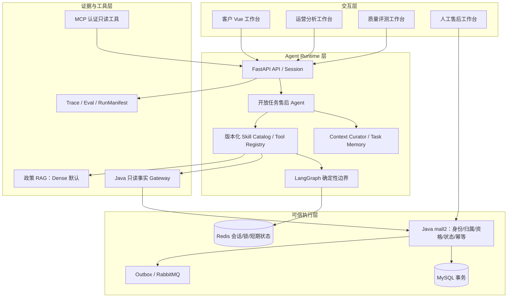

# Mall AI 售后平台：架构与责任边界

本项目是基于 Apache-2.0 `macrozheng/mall` 的二次开发。本页描述当前仓库中的本地合成演示与代码边界，不表示生产部署、真实用户数据或生产 SLA。

## 四层结构

核心写路径是：`Agent 计划 → 只读事实/政策证据 → ActionProposal → 客户明确确认 → Java 重新校验 → MySQL 事务/幂等 → Outbox/RabbitMQ`。模型不能直连商城数据库、创建设备外的 Skill、绕过确认或把自由文本当作业务命令。

## 产品角色

系统只有一个在线核心 Agent：**统一售后开放任务 Agent**。运营分析 AI 与 AI 质量评测是两个受限的辅助能力；MCP 只读工具、人工工作台和确定性 Workflow 是执行设施，不是第四个在线 Agent。

| 角色/组件 | 输入 | 允许输出 | 明确禁止 |
| --- | --- | --- | --- |
| 客户 | 自然语言目标、确认/撤回 | 公开事实卡、政策引用、候选方案、状态 | 接触内部 intent、Token、完整订单号或工具载荷 |
| 开放任务 Agent | 目标、活动任务摘要、允许的 Artifact | TaskPlan、只读 Skill 选择、澄清、ActionProposal 草案 | 直接写订单/售后/退款，猜权限或内部 ID |
| 运营分析 AI | Java 可信聚合、固定 7/30 天窗口 | 受限分析草稿 | 改窗口、编造指标、业务写入 |
| 质量评测 AI | 版本化合成 EvalCase、Profile | 硬规则结果、可选失败归因候选 | 读取真实聊天/订单，自动修改 Prompt/代码 |
| Java mall2 | JWT、事实、Proposal、确认 | 资格/状态判断、事务写入、审计与事件 | 把模型建议当作事实 |
| RAG | 审核过的政策文档 | 带来源的证据投影 | 判断订单、物流、资格或最终状态 |
| MCP | 认证身份和 allow-list | 只读事实/政策工具结果 | 写操作、SQL、任意 URL、越权跨账号访问 |

## 真实代码位置

| 能力 | 主要代码位置 | 责任 |
| --- | --- | --- |
| 客户 API | `mall-ai-service/app/routers/customer_service.py`、`agent_tasks.py` | 认证会话、公开 DTO、任务创建/继续/确认 |
| Runtime | `mall-ai-service/app/runtime/task_runtime.py`、`task_planner.py`、`task_store.py` | 有界计划、Skill 发现、观察、Context 更新、Proposal 门 |
| Context/Memory | `mall-ai-service/app/runtime/context_curator.py`、`task_memory.py`、`app/schemas/agent_task.py` | 允许的 Artifact 摘要、owner/TTL、恢复投影 |
| Skill/Tool | `mall-ai-service/app/skills/catalog.py`、`app/services/tool_registry.py`、`commerce_gateway.py` | 版本、Schema、工具白名单、身份范围、预算与超时 |
| 统一售后 | `mall-ai-service/app/services/unified_after_sales_graph.py`、`after_sales_application_service.py` | 政策、资格、申请、列表、状态、取消、修改与跟进的确定性业务边界 |
| RAG | `app/services/chunking_service.py`、`policy_retrieval.py`、`rag_service.py`、`vector_store.py` | Chunk/metadata、Dense 检索、证据核验与无证据拒答 |
| Trace/Eval | `app/services/trace_service.py`、`app/runtime/release_evaluation.py`、`scripts/run_quality_agent_evaluation.py` | 脱敏 Trace、合成 Case、确定性比较器与 Release Manifest |
| MCP | `app/routers/mcp.py`、`app/schemas/mcp.py` | 认证 Streamable HTTP/SSE 只读工具边界 |
| Java 权威 | `mall2/mall-portal/.../AiAfterSalesApplicationServiceImpl.java`、`AiCaseHandoffServiceImpl.java`、`AiAfterSalesOutboxPublisher.java` | JWT、归属、资格、状态机、幂等、事务、Outbox/RabbitMQ、最终写入 |
| 前端 | `mall-ai-web/src/App.vue`、`AgentTaskWorkspace.vue`、`OperationsPanel.vue`、`QualityPanel.vue` | 公开投影、确认卡、角色隔离；不持有内部写权限 |

## 一次请求的边界

1. FastAPI 从登录会话和 Java 返回事实确定身份范围；模型不能提供 `memberId`、角色或权限。
2. Agent 读取活动任务/唯一暂停任务的脱敏摘要，决定继续、澄清、临时切题、恢复或结束；只在注册 Skill 的工具范围内规划。
3. Java 订单/物流/资格/售后事实与政策 RAG 证据分开提供。无证据、依赖失败或结构化输出非法时安全停止。
4. 有副作用的请求先形成绑定 owner、版本、TTL、内容哈希和确认状态的 ActionProposal。浏览器不能绕过确认卡直达 Java 写接口。
5. 客户确认后，Java 重新读取必要事实，执行 JWT、归属、资格、状态机和幂等校验，并在同一事务中写入业务、审计和 Outbox。
6. RabbitMQ 消息只携带 opaque reference；消费者和回调幂等。支付、仓储、物流、维修等外部履约未接入时，状态保持 `NOT_STARTED`/`MANUAL_REQUIRED`，不会伪造成功。

## 数据、可见性和失败处理

- Redis 只保存会话、锁、待确认状态和短期可过期事件；任务/Proposal 索引使用独立的可追溯存储。进程重启不能重复执行已成功的 Java 动作。
- 公开 DTO 只包含脱敏摘要、状态和 opaque reference；禁止 Token、原始 Prompt/聊天、完整订单号、地址、电话、RAG 原文、原始工具载荷、内部 Trace 和模型思维链。
- 客户、运营、质量开发者和人工售后处理人员使用不同身份、页面、工具范围和 DTO。
- 观测/评测故障不阻塞客户业务，也不改变 Java 写入结果。质量硬门由确定性比较器裁决，LLM 只能辅助失败解释。

## 验证口径

仓库同时保留无模型 deterministic contract、合成 live-model/Provider 评测、本地 Docker/Chrome/Java 现场和 GitHub Actions 四种证据；它们必须在报告中分开。当前公开验证的真实范围、报告提交号和仍不能宣称的能力见 [测试与演示证据](TEST_AND_DEMO_EVIDENCE.md)、[GitHub 展示升级证据](evidence/github-showcase-refresh.md) 和 [公开发布记录](PUBLIC_RELEASE_RECORD.md)。
