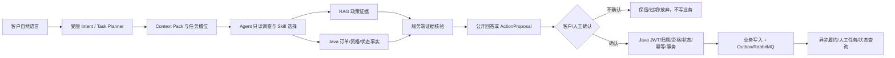

# 产品、角色与核心流程

## 产品定位

Mall AI After-sales Platform 是基于 `macrozheng/mall` 二次开发的可信电商售后协同平台。客户可以用自然语言咨询政策、核验订单/售后事实、发起售后草案、查询处理状态并获得人工协同；运营可以查看受限聚合和案件队列；质量/开发者可以运行合成评测和查看脱敏证据。

它不是普通聊天机器人：模型只理解语言、选择受限能力和生成结构化草案；订单事实、JWT、归属、资格、状态机、幂等、事务和最终写入由 Java mall2 权威服务完成。

## 角色边界

| 角色 | 可以做什么 | 明确不能做什么 |
| --- | --- | --- |
| 客户 | 查询自己的订单/售后，咨询政策，提交待确认售后申请 | 读取他人对象、直接调用 Java 写接口、看到内部 ID/Trace |
| 运营/人工售后 | 查看受限队列、领取/补件/处理案件，执行角色允许的状态变化 | 复用客户 Token，绕过 Java 状态机 |
| 质量/开发者 | 查看合成 Eval、合同结果和脱敏统计 | 读取真实聊天/订单或自动改代码/Prompt |
| 模型/Agent | 生成受限 Intent/TaskPlan、选择白名单 Skill、组织事实证据 | 自创工具、猜内部 ID、改业务库、伪造履约成功 |

## 主流程

## 统一售后八类动作

`policy`、`eligibility`、`apply`、`list`、`status`、`cancel`、`modify`、`follow_up` 通过同一入口进入受限结构化路由。申请类型为 `cancel_refund`、`return_refund`、`exchange`、`repair`。创建、取消、修改都要经过服务端生成 Proposal/Action、客户明确确认和 Java 最终校验。

## 任务感知 Agent 与 Workflow 分工

任务感知层读取当前消息、`active_task`、最多一个 `paused_task` 和 `transaction_gate`，决定继续、临时岔开、恢复、放弃或自然澄清。Workflow 只承担事实读取、资格核验、Proposal、确认和 Java 写入等必须确定的节点。缺订单号不自动等价于固定 `interrupt()`；应由 Agent 产生可恢复的等待输入任务。

## 失败与恢复

模型不可用、结构化 JSON 非法、证据不足、工具越权、版本冲突、Redis/Provider 故障时安全停止，不退回关键词路由，不写业务。Redis/任务存储只保存脱敏任务摘要、短期状态和交易关口；重启恢复后必须重新读取必要 Java 事实，已成功的 Java 动作不会由 AI 层重复提交。

