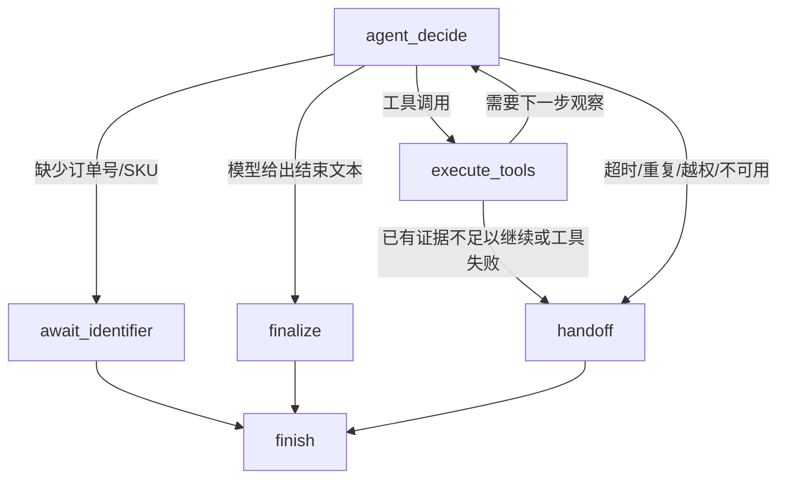

# Build 14: LangGraph 证据驱动订单异常诊断 Agent

## Status

Built, unit-tested and locally Docker live-verified. The Vue type-check and
production build passed. A disposable two-account local verification exercised
the public FastAPI API against the Dockerized Java mall, Redis, RAG and
LangGraph services. This is local evidence only, not a production release or a
claim about general model accuracy.

## Problem Solved

The baseline Agent could call read-only tools, but it did not expose a
complete, reviewable diagnosis path for a question such as:

> 订单为什么一直没到，我现在怎么办？

This build adds a real LangGraph state machine that can loop through order,
logistics and policy evidence, then stop safely with a diagnosis or a human
handoff.

## Graph Flow

LangGraph owns the transitions and state updates. Java owns identity,
ownership and business facts. The existing Redis conversation store remains
the cross-request state boundary; this graph is one bounded diagnostic run and
does not pretend to replace Redis with process memory.

## User-Visible Behavior

- A complete run returns verified order/logistics facts, a policy-grounded
  category such as “物流仍在运输或派送中”, and allowed next steps. Internal
  policy source metadata remains on the service side.
- A missing identifier returns a resumable pending tool call without executing
  the tool prematurely.
- Missing policy evidence, tool failure, timeout, repeated calls and blocked
  write tools stop in a controlled handoff branch.
- The customer never receives raw model tool arguments, raw tool payloads or
  internal graph traces.

## Key Files

- `app/services/diagnosis_agent.py`: LangGraph nodes, conditional edges,
  bounded loop, safe diagnosis construction and handoff behavior.
- `app/schemas/diagnosis.py`: diagnosis category, evidence status, next-step
  and handoff contracts.
- `app/services/agent_service.py`: compatibility entry point; only
  `diagnosis=True` routes the multi-tool case through LangGraph.
- `app/services/customer_service.py` and
  `app/schemas/customer_service.py`: public response wiring.
- `mall-ai-web/src/App.vue` and `mall-ai-web/src/types.ts`: customer-safe
  diagnosis card.

## Technical Decisions

- LangGraph is used because the diagnosis path has an explicit loop and
  multiple terminal branches. The old custom ReAct loop remains as a small
  baseline and compatibility path.
- Tools remain a read-only allow-list. The graph cannot create or modify an
  order, return application or refund.
- The model may choose the next read-only observation, but the server builds
  facts, policy sources, categories and allowed actions from tool results.
- A policy retrieval result with `no_evidence` stops the graph instead of
  asking the model to guess a policy conclusion.
- No LangGraph checkpointer is added yet. Cross-request return drafts and
  pending tool calls already use Redis; a persistent graph checkpoint becomes
  useful only when pause/resume or human handoff needs graph-level recovery.

## Verification

- Python full suite: `121/121` passed.
- LangGraph diagnosis cases: `4/4` passed.
- The four cases cover complete diagnosis, no policy evidence, missing order
  identifier and tool failure.
- Vue type-check and production build passed.
- Docker local live verification passed through
  `scripts/verify_build14_live.py`:
  - two disposable accounts authenticated through FastAPI -> Java;
  - a real order-delay question invoked `order_service`, `logistics_service`
    and `rag_search`, then returned a diagnosis with complete local evidence;
  - account B received no facts from account A's order;
  - the diagnosis did not create a return application.
- The verification script deliberately omits passwords, Bearer tokens, member
  identifiers and order numbers from its output.
- No production deployment, production traffic claim or statistically valid
  model-quality claim is made in this build.

## Recommended Next Action

Open a learning branch for Build 14 using the fixed teaching order: first walk
the request-to-graph chain, then read the key nodes and state contract, then
read the tests and failure branches. After that, the mainline should build the
production reliability batch: idempotency key, timeout-result recovery and
retry-safe status lookup.
